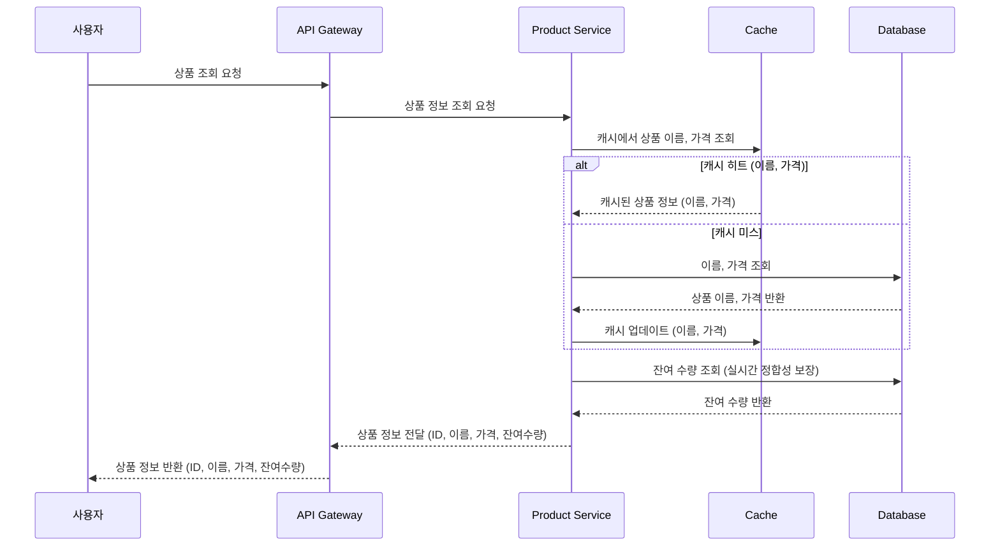
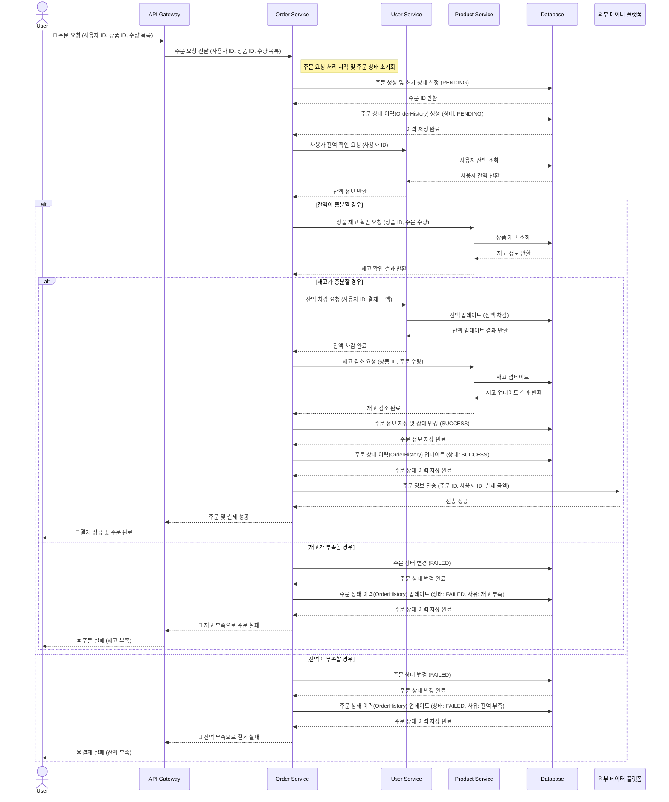
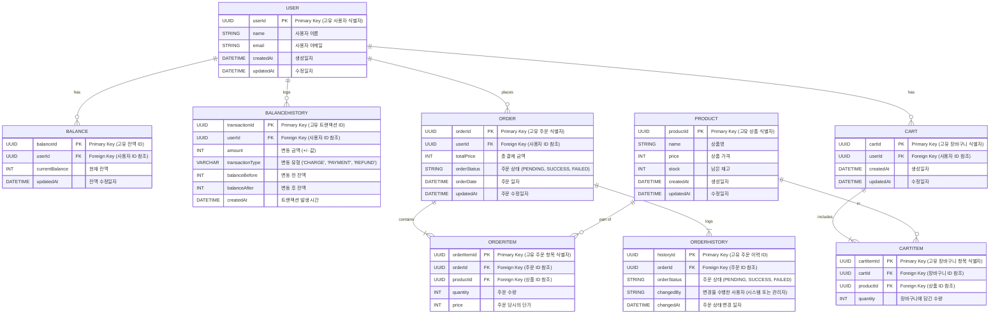

## 1. Service Scenario

### e-커머스 서비스

## 2. Milestone

### 1주차: 시나리오 분석 및 프로젝트 준비 (10/5 ~ 10/11)

- **시나리오 분석 및 요구사항 정의:**
    - 개발 환경 준비
        - Architecture, DB ORM, Test
- **시나리오 분석 및 요구사항 정의:**
    - 각 API의 요구사항 분석 및 시퀀스 다이어그램, 플로우차트 작성

- **ERD 설계:**
    - `User`, `Product`, `Order`, `Cart` 등의 도메인 분석 및 ERD 정의

- **API 명세 및 Mock API 설계:**
    - 잔액 충전/조회, 상품 조회, 주문/결제, 상위 상품 조회, 장바구니 기능에 대한 API 명세서 작성
    - 각 API의 URL, 요청/응답 형식, 에러 케이스 정의

- **초기 Mock API 작성:**
    - 각 API의 Mock 버전을 간단히 구현하여 프론트엔드에서 사용할 수 있도록 제공
    - 프로젝트 기본 패키지 구조 및 설정 완료

---

### 2주차: 잔액 충전 / 조회 API 개발 (10/12 ~ 10/18)

- **API 개발:**
    - `POST /balance/charge`: 사용자 ID와 금액을 받아 잔액을 충전하는 기능 개발
    - `GET /balance`: 사용자 ID를 통해 현재 잔액 조회

- **동시성 제어 및 트랜잭션 적용:**
    - **Pessimistic Locking** 또는 **Optimistic Locking** 적용하여 동시성 문제 해결
    - 여러 요청이 동시에 들어올 때 데이터가 일관성 있게 관리되도록 처리

- **단위 테스트 작성:**
    - 잔액 부족, 음수 금액 충전, 잘못된 사용자 ID 처리 및 검증

---

### 3주차: 상품 조회 API 및 재고 관리 로직 개발 (10/19 ~ 10/25)

- **API 개발:**
    - `GET /products`: 상품 ID, 이름, 가격, 잔여 수량을 포함한 상품 목록 반환

- **재고 관리 로직 개발:**
    - 실시간 재고 관리 로직 개발 (상품 수량이 정확하게 조회 및 관리)

- **테스트 시나리오 작성:**
    - 다수 사용자가 동시에 상품을 조회할 때 재고 정보가 정확하게 조회되는지 검증
    - 재고가 부족할 때의 예외 처리 및 데이터 일관성 테스트

---

### 4주차: 주문 / 결제 API 개발 및 데이터 플랫폼 연동 (10/26 ~ 11/1)

- **API 개발:**
    - `POST /order`: 사용자 ID와 (상품 ID, 수량) 목록을 받아 주문 생성 및 결제 수행
    - 주문 생성 시, 사용자 잔액 차감 및 상품 재고 감소 로직 구현

- **동시성 제어 및 트랜잭션 처리:**
    - 다수의 주문 요청이 동시에 발생해도 트랜잭션과 락을 통해 데이터 정합성 유지

- **데이터 플랫폼 연동 (Kafka, Spark):**
    - 주문 성공 시, Kafka를 통해 주문 데이터를 데이터 플랫폼으로 전송
    - Spark를 통해 실시간 통계 데이터 생성 및 관리

- **통합 테스트:**
    - 주문 및 결제 시나리오 테스트, 데이터 플랫폼 연동 검증

---

### 5주차: 상위 판매 상품 조회 API 및 장바구니 기능 개발 (11/2 ~ 11/8)

- **상위 판매 상품 조회 API 개발:**
    - `GET /products/top`: 최근 3일간 가장 많이 팔린 상위 5개 상품 조회
    - 판매 통계 데이터를 기반으로 상위 상품을 정확하게 정렬 및 반환

- **장바구니 기능 개발:**
    - `POST /cart/add`: 장바구니에 상품 추가
    - `DELETE /cart/remove`: 장바구니에서 상품 제거
    - `GET /cart`: 장바구니에 담긴 상품 목록 조회

- **장바구니와 주문 연동:**
    - 장바구니의 상품을 주문할 때, 장바구니와 주문 상태가 정합성 있게 유지되도록 설계
    - 전체 시스템 통합 테스트 및 성능 최적화

---

## 시나리오 요구사항 분석

### 1.잔액 충전 / 조회 API


### 2.상품 조회 API



### 3.주문 / 결제 API



---

# 3. ERD



---
# API 명세서
| **API Name**          | **Endpoint**          | **Method** | **Request** | **Response** | **Description**                           |
|-----------------------|-----------------------|------------|-------------|--------------|-------------------------------------------|
| **잔액 충전 API**     | `/balance/charge`     | `POST`     | `{ "userId": "string", "amount": 1000 }` | `{ "userId": "string", "currentBalance": 2000 }` | 사용자의 충전 요청을 처리하고, 잔액을 업데이트합니다. |
| **잔액 조회 API**     | `/balance`            | `GET`      | `userId=string`  | `{ "userId": "string", "currentBalance": 2000 }` | 특정 사용자의 현재 잔액을 조회합니다.            |
| **상품 조회 API**     | `/products`           | `GET`      | 없음          | `[ { "productId": "string", "name": "string", "price": 1000, "stock": 10 } ]` | 모든 상품의 정보를 조회합니다.                   |
| **주문 생성/결제 API**| `/order`              | `POST`     | `{ "userId": "string", "items": [ { "productId": "string", "quantity": 2 } ] }` | `{ "orderId": "string", "userId": "string", "totalPrice": 3000, "orderStatus": "SUCCESS" }` | 사용자가 여러 상품을 선택하여 주문을 생성하고 결제를 수행합니다. |
| **상위 상품 조회 API**| `/products/top`       | `GET`      | 없음          | `[ { "productId": "string", "name": "string", "price": 1000, "totalSales": 20 } ]` | 최근 3일간 가장 많이 판매된 상위 5개 상품 조회 |

---

### Error Codes
| **Error Code**          | **Description**                                      |
|-------------------------|------------------------------------------------------|
| **400 Bad Request**     | 잘못된 요청 (예: 요청 값이 비어 있거나 형식이 잘못된 경우) |
| **404 Not Found**       | 리소스를 찾을 수 없음 (예: 잘못된 ID로 조회 시)            |
| **500 Internal Server Error** | 서버 내부 오류                                    |

---
# 프로젝트 구조

### 클린 레이어드 아키텍처

```
├── application
├── domain
│   └── repository
├── infra
│   └── repository
└── interfaces
    ├── api
    ├── dto
```

--- 

# 기술 스텍

### Backend

- Spring Boot 3.3.4: 애플리케이션 개발 프레임워크
- Spring Data JPA: 데이터베이스 액세스 및 ORM
- Spring RestDocs: API 문서화

### Database

- PostgreSQL: 메인 데이터베이스
- H2 Database: 테스트용 인메모리 DB

### Caching & Messaging

- Redis: 캐싱 솔루션 (재고 정보 및 세션 관리)
- Apache Kafka: 비동기 메시징 큐 및 이벤트 스트리밍

### Build Tools

- Gradle: 빌드 및 의존성 관리

### Testing

- JUnit 5: 단위 테스트 프레임워크
- Mockito: Mock 객체 생성
